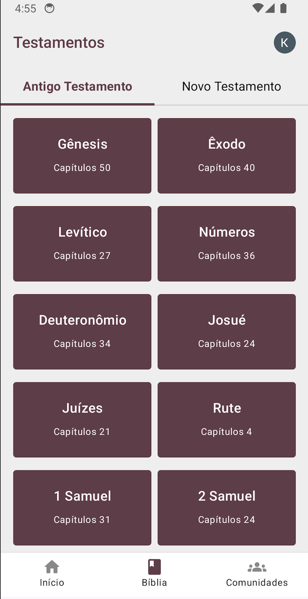
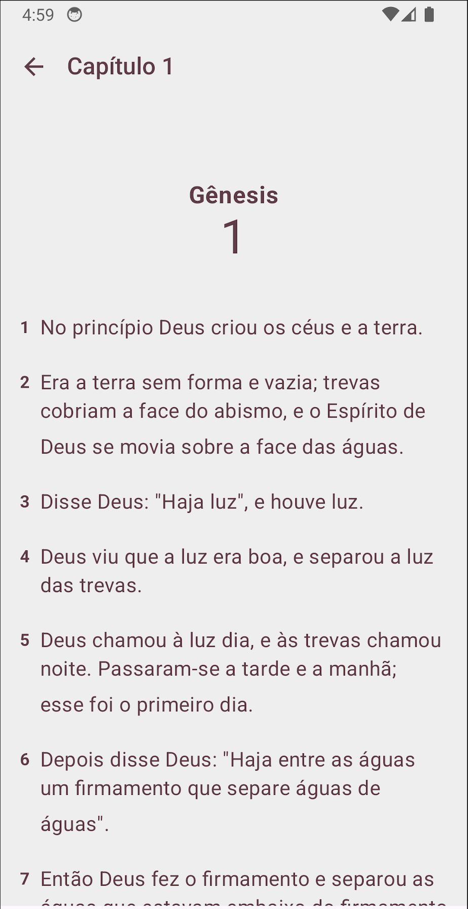
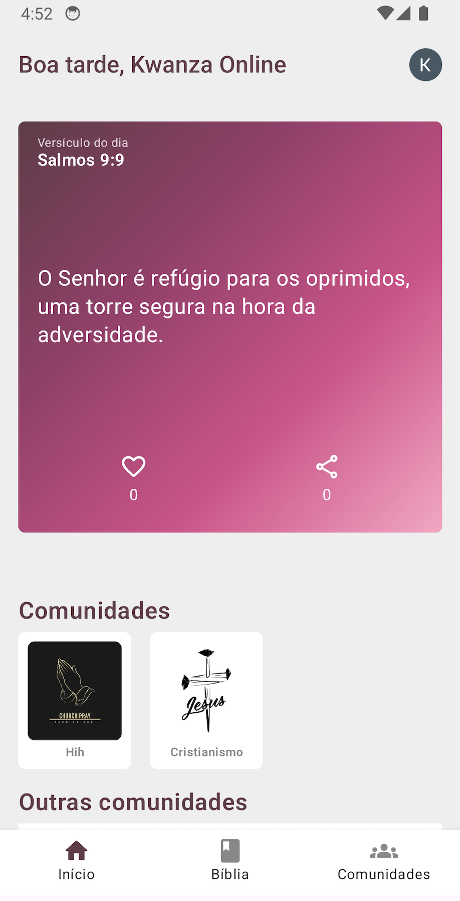
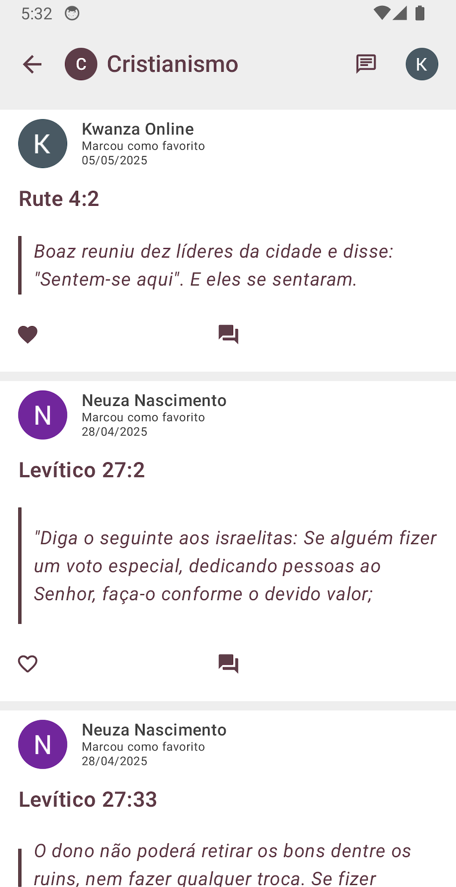
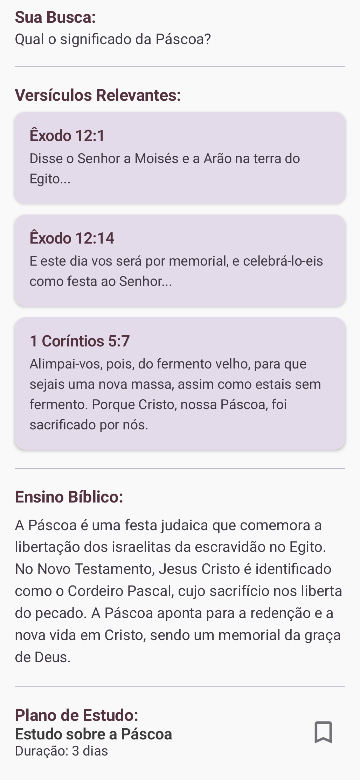

# Instruções para Adicionar Screenshots

Para incluir as imagens reais no README, você tem algumas opções:

## Opção 1: Usar GitHub (Recomendado)
1. Coloque as imagens na pasta `assets/screenshots/`
2. Faça commit e push para o GitHub
3. Substitua as URLs no README.md por:
   ```
   
   
   
   
   
   ```

## Opção 2: Usar Imgur ou Similar
1. Faça upload das imagens para https://imgur.com
2. Substitua as URLs no README.md pelas URLs reais do Imgur

## Imagens dos Anexos
Com base nos anexos fornecidos, salve as seguintes imagens:

1. **testamentos.png** - Primeira imagem: Tela com "Testamentos" mostrando Antigo e Novo Testamento com livros como Gênesis, Êxodo, Levítico, etc.

2. **genesis-chapter.png** - Terceira imagem: Capítulo 1 de Gênesis mostrando versículos numerados

3. **home-verse.png** - Segunda imagem: Tela inicial com "Boa tarde, Kwanza Online" e versículo do dia (Salmos 9:9)

4. **community-feed.png** - Quinta imagem: Feed da comunidade "Cristianismo" com posts de usuários

5. **ai-search.png** - Quarta imagem: Resultado da busca por IA sobre "Qual o significado da Páscoa?"

## Nomes dos Arquivos Sugeridos
- `testamentos.png` (1280x768 ou similar)
- `genesis-chapter.png` 
- `home-verse.png`
- `community-feed.png` 
- `ai-search.png`

## Redimensionamento
Para melhor visualização no README, redimensione as imagens para:
- Largura: 250-300px
- Manter proporção original
- Formato PNG ou JPG
